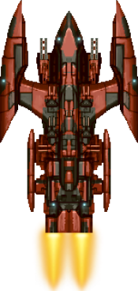
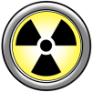

# SpaceShooter

Простая игра, где вам нужно уничтожать вражеские корабли и не дать врагу уничтожить ваш корабль. У игры нет конца (кроме проигрыша) и нет ограничений по уровню.

A simple game where you need to destroy enemy ships and not let enemy destroy your ship. The game does not have a end (except for a loss) and not level restrictions.

## Описание
  
  - Переход на следующий уровень осуществляется после набора **20** фрагов.  
  - Изначально дается **3** жизни. За каждые **200** фрагов добавляется 1 жизнь.  
  - Каждые 3 уровня прочность корабля увеличивается в зависимости от выбранной сложности (легкая - на 20, нормальная - на 10, сложная - на 5).  
  - В игре 4 босса. Боссы появляются на **5, 15, 25 и 50** уровнях.  
  - В игре имеется возможность сохранить прогресс. Каждое следующее сохранение перезаписывает предыдущее. 
  - Победа над боссом улучшает корабль. 1 босс - +50 прочности, 2 босс - двойные пушки, 3 босс - тройные пушки, 4 босс - +250 к прочности.
  
  

  
EN

    
   - The transition to the next level occurs after **20** frags.
   - Initially, the ship has **3** lives. For every **200** frags, 1 life is added.
   - Each 3 levels of ship durability increase depending on the chosen complexity (easy - by 20, normal - by 10, hard - by 5).
   - The game has 4 bosses. Bosses appear at **5, 15, 25 and 50** levels.
   - The game has the ability to save progress. Each subsequent save overwrites the previous one.
   - Victory over the boss improves the ship. 1 boss - +50 durability, 2 boss - double guns, 3 boss - triple guns, 4 boss - +250 durability.
  

  
<h3>

Подробней
  
   
<ul>
<li>

  
Корабль игрока
 
  <table><tr>
    <td></td>
    <td><b>Прочность</b>: 100 
    <b>Урон</b>: 1 
    <b>Скорострельность</b>: 4</td>
  </tr></table>

</li>
<li>

  
Враги
 
  <table>
    <tr>
      <td><b>Малый скаут</b> </td>
      <td><b>Прочность</b>: 3 
      <b>Урон</b>: 2 
      <b>Скорострельность</b>: 1</td>
    </tr>
    <tr>
      <td><b>Средний скаут</b> </td>
      <td><b>Прочность</b>: 5 
      <b>Урон</b>: 3 
      <b>Скорострельность</b>: 1</td>
    </tr>
    <tr>
      <td><b>Истребитель</b> </td>
      <td><b>Прочность</b>: 8 
      <b>Урон</b>: 5 
      <b>Скорострельность</b>: 0.5</td>
    </tr>
    <tr>
      <td><b>Средний истребитель</b> </td>
      <td><b>Прочность</b>: 10 
      <b>Урон</b>: 7 
      <b>Скорострельность</b>: 0.5</td>
    </tr>
    <tr>
      <td><b>Тяжелый истребитель</b> </td>
      <td><b>Прочность</b>: 15 
      <b>Урон</b>: 7 
      <b>Скорострельность</b>: 0.5</td>
    </tr>
     <tr>
      <td><b>Крейсер</b> </td>
      <td><b>Прочность</b>: 15 
      <b>Урон</b>: 10 
      <b>Скорострельность</b>: 0.4</td>
    </tr>
    <tr>
      <td><b>Тяжелый крейсер</b> </td>
      <td><b>Прочность</b>: 18 
      <b>Урон</b>: 12 
      <b>Скорострельность</b>: 0.4</td>
    </tr>
  </table>

</li>
<li>

  
Боссы
 
  <table>
    <tr>
      <td><b>Линкор</b> </td>
      <td><b>Прочность</b>: 80 
      <b>Урон</b>: 9 
      <b>Скорострельность</b>: 1.3</td>
    </tr>
    <tr>
      <td><b>Ударный крейсер</b> </td>
      <td><b>Прочность</b>: 100 
      <b>Урон</b>: 10 
      <b>Скорострельность</b>: 1</td>
    </tr>
    <tr>
      <td><b>Тяжелый линкор</b> </td>
      <td><b>Прочность</b>: 180 
      <b>Урон</b>: 15 
      <b>Скорострельность</b>: 0.6</td>
    </tr>
    <tr>
      <td><b>Шип-матка</b> </td>
      <td><b>Прочность</b>: 250 
      <b>Урон</b>: 20 
      <b>Скорострельность</b>: 1</td>
    </tr>
  </table>

</li>
<li>

  
Бонусы
 
  <table>
    <tr>
      <td><b>Усиление орудий</b> </td>
      <td>Увеличивает скорость стрельбы и выпускает по 3 пули.</td>
    </tr>
    <tr>
      <td><b>Лечение</b> </td>
      <td>Восстанавливает прочность. Объем восстановления зависит от уровня.</td>
    </tr>
    <tr>
      <td><b>Щит</b> </td>
      <td>Окружает корабль щитом на несколько секунд. Щит блокирует весь урон.</td>
    </tr>
    <tr>
      <td><b>Ядерный удар</b> </td>
      <td>Взрывает ядерный заряд, который уничтожает все объекты на экране. На боссов не действует.</td>
    </tr>
  </table>

</li>

</h>
  
<h3>

More details
  
   
<ul>
<li>

  
Player ship
 
  <table><tr>
    <td></td>
    <td><b>Durability</b>: 100 
    <b>Damage</b>: 1 
    <b>Fire rate</b>: 4</td>
  </tr></table>

</li>
<li>

  
Enemyes
 
  <table>
    <tr>
      <td><b>Small scout</b> </td>
      <td><b>Durability</b>: 3 
      <b>Damage</b>: 2 
      <b>Fire rate</b>: 1</td>
    </tr>
    <tr>
      <td><b>Middle scout</b> </td>
      <td><b>Durability</b>: 5 
      <b>Damage</b>: 3 
      <b>Fire rate</b>: 1</td>
    </tr>
    <tr>
      <td><b>Fighter</b> </td>
      <td><b>Durability</b>: 8 
      <b>Damage</b>: 5 
      <b>Fire rate</b>: 0.5</td>
    </tr>
    <tr>
      <td><b>Middle fighter</b> </td>
      <td><b>Durability</b>: 10 
      <b>Damage</b>: 7 
      <b>Fire rate</b>: 0.5</td>
    </tr>
    <tr>
      <td><b>Heavy fighter</b> </td>
      <td><b>Durability</b>: 15 
      <b>Damage</b>: 7 
      <b>Fire rate</b>: 0.5</td>
    </tr>
     <tr>
      <td><b>Cruiser</b> </td>
      <td><b>Durability</b>: 15 
      <b>Damage</b>: 10 
      <b>Fire rate</b>: 0.4</td>
    </tr>
    <tr>
      <td><b>Heavy cruiser</b> </td>
      <td><b>Durability</b>: 18 
      <b>Damage</b>: 12 
      <b>Fire rate</b>: 0.4</td>
    </tr>
  </table>

</li>
<li>

  
Bosses
 
  <table>
    <tr>
      <td><b>Battleship</b> </td>
      <td><b>Durability</b>: 80 
      <b>Damage</b>: 9 
      <b>Fire rate</b>: 1.3</td>
    </tr>
    <tr>
      <td><b>Strike cruiser</b> </td>
      <td><b>Durability</b>: 100 
      <b>Damage</b>: 10 
      <b>Fire rate</b>: 1</td>
    </tr>
    <tr>
      <td><b>Heavy battleship</b> </td>
      <td><b>Durability</b>: 180 
      <b>Damage</b>: 15 
      <b>Fire rate</b>: 0.6</td>
    </tr>
    <tr>
      <td><b>Mothership</b> </td>
      <td><b>Durability</b>: 250 
      <b>Damage</b>: 20 
      <b>Fire rate</b>: 1</td>
    </tr>
  </table>

</li>
<li>

  
Bonuses
 
  <table>
    <tr>
      <td><b>Gun reinforcement</b> </td>
      <td>Increases rate of fire and fires 3 bullets each shot.</td>
    </tr>
    <tr>
      <td><b>Healing</b> </td>
      <td>Restores durability. The amount of recovery depends on the level.</td>
    </tr>
    <tr>
      <td><b>Shield</b> </td>
      <td>Surrounds the ship with a shield for a few seconds. Shield blocks all damage.</td>
    </tr>
    <tr>
      <td><b>Nuclear strike</b> </td>
      <td>Explodes a nuclear charge that destroys all the objects on the screen. Doesn’t affect bosses.</td>
    </tr>
  </table>

</li>

</h>

## Установка/Installation

### Android

Скачайте [APK](readme/SpaceShooter.apk?raw=true) файл и установите его.

Download [APK](readme/SpaceShooter.apk?raw=true) and install it.

### Windows/Linux/MacOS

Скачайте [JAR](readme/SpaceShooter.jar?raw=true) файл и запустите его. Для запуска необходима Java 1.8+. Скачать Java можно [здесь](https://www.java.com/ru/download/).

Download [JAR](readme/SpaceShooter.jar?raw=true) and run it. This content requires Java 1.8+. You can download Java [here](https://www.java.com/ru/download/).

## Управление/Control

**PC версия**: стрелки влево/вправо, нажатием мыши по экрану.  
**Android версия**: нажатие по экрану, акселерометр (по умолчанию выключен, включается в настройках).  

**PC version**: left / right arrows, mouse clicking on the screen.  
**Android version**: screen tap, accelerometer (by default off, turns on in properties).

<h2>

  
Скриншоты/Screenshots

  
  
  

</h2>

## Автор/Author

Ilya Mafov <i.mafov@gmail.com>

## Лицензия/License

GNU GPLv3 [LICENSE](LICENSE)
